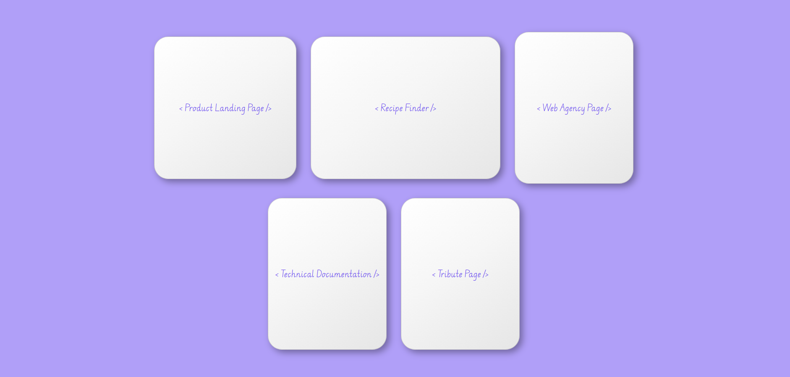
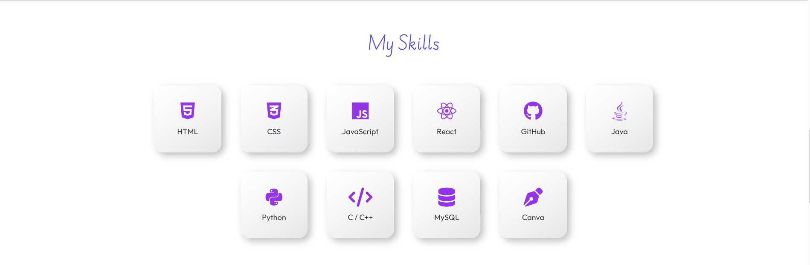
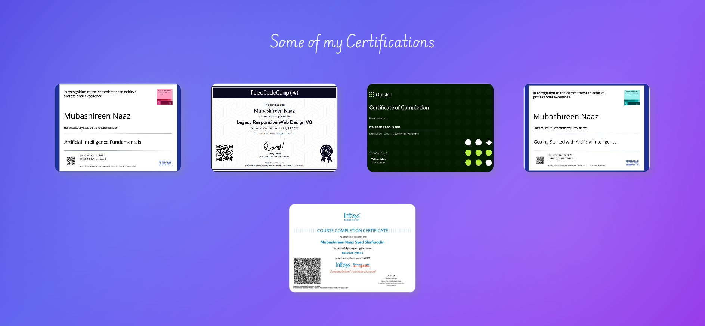

## Version 1 – Portfolio Structure (HTML & CSS)

### Home Page Layout

### About Section Layout

### Projects Section Layout

### Footer Section Layout

## Version 2 – Portfolio Implementation
### Home Page

### Projects Section

### Skills Section

### About Section

### Certificates Section

### Contact Section

